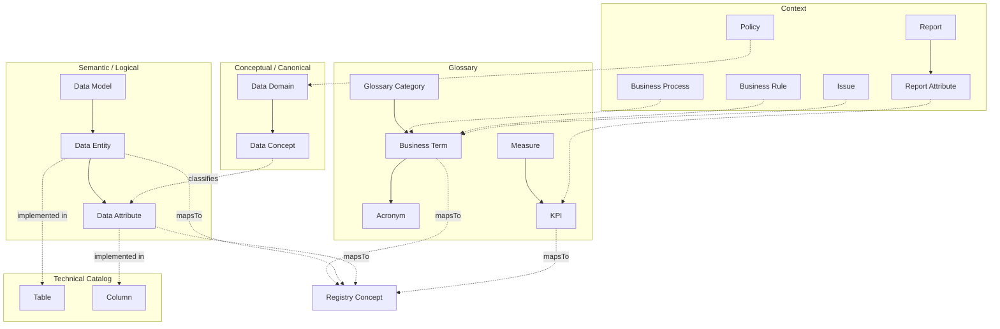

# Hierarchy And Relations — Business Catalog

## Layers

| Layer | Collibra analogue | Asset types |
| --- | --- | --- |
| Glossary | Business Glossary | Business Term · Acronym · Glossary Category · Measure · KPI |
| Conceptual (canonical) | Guided Stewardship conceptual | Data Domain · Data Concept |
| Semantic (logical) | Guided Stewardship semantic | Data Model · Data Entity · Data Attribute |
| Context | Process / governance / Report Catalog | Business Process · Business Rule · Policy · Issue · Report · Report Attribute |

Cross-tool matrix: [03. Catalog Tool Coverage](03.%20Catalog%20Tool%20Coverage.md)

## Normative relations

| From | Predicate | To | Public ID / owner |
| --- | --- | --- | --- |
| Glossary Category | contains | Business Term | `GlossaryCategoryContainsBusinessTerm` |
| Measure | specialized by | KPI | `MeasureHasKPI` |
| Data Domain | contains | Data Concept | `DataDomainContainsDataConcept` |
| Data Model | contains | Data Entity | `DataModelContainsDataEntity` |
| Data Entity | contains | Data Attribute | `DataEntityContainsDataAttribute` |
| Data Concept | classifies | Data Attribute | `DataConceptClassifiesDataAttribute` |
| Report | contains | Report Attribute | `ReportContainsReportAttribute` |
| Data Entity | implemented in | Table | `DataEntityImplementedInTable` |
| Data Attribute | implemented in | Column | `DataAttributeImplementedInColumn` |
| Business Term / KPI / Entity / Attribute | mapsTo | Registry Concept | Mapping Engine (DA-08) |

## Rules

1. Do not treat glossary prose as enterprise meaning SoR.  
2. Canonical groupings live as Data Domain / Data Concept (Collibra) **and** Registry group/entity concepts (Control Plane) linked by `mapsTo`.  
3. Semantic Entity/Attribute bridge physical Table/Column without replacing technical catalog.  
4. Context assets (process, rule, policy, issue, report) consume or constrain meaning; they do not redefine Registry concepts.  
5. KPI/Measure Calculation Rule in the catalog is descriptive; authoritative calc stays beside the semantic layer (SQ1).

JSON: [`hierarchy.relations.json`](hierarchy.relations.json)
