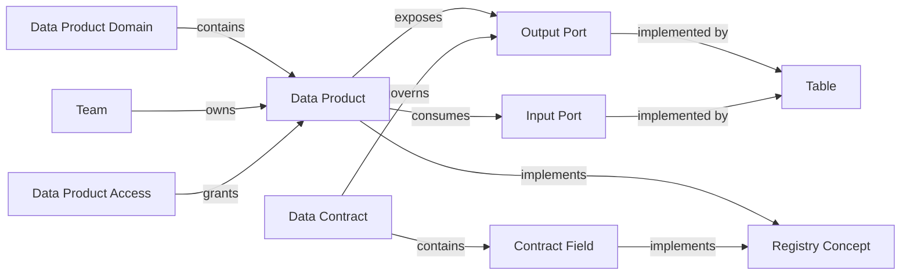

# Hierarchy And Relations — Data Products

Cross-tool matrix: [03. Catalog Tool Coverage](03.%20Catalog%20Tool%20Coverage.md)

## Normative relations

| From | Predicate | To | Public ID / owner |
| --- | --- | --- | --- |
| Data Product Domain | contains | Data Product | `DomainContainsDataProduct` |
| Team | owns | Data Product | `TeamOwnsDataProduct` |
| Data Product | exposes | Output Port | `DataProductExposesDataProductPort` |
| Data Product | consumes | Input Port | `DataProductConsumesDataProductPort` |
| Data Contract | governs | Port | `DataContractGovernsDataProductPort` |
| Data Contract | contains | Contract Field | `DataContractContainsContractField` |
| Data Product Access | grants | Data Product | `AccessGrantsDataProduct` |
| Port | implemented by | Table | `DataProductPortImplementedByTable` |
| Data Product / Contract Field | implements | Registry Concept | Mapping Engine (DA-10) |

## Rules

1. Marketplace is SoR for product lifecycle, access, and ODCS manifests.  
2. Every published Output Port should have a governing Data Contract.  
3. Prefer ODCS for manifests; `authoritativeDefinitions` of type `semantics` must resolve to approved Registry concepts.  
4. SLA remains a **characteristic** of Data Contract (not a separate asset type).

JSON: [`hierarchy.relations.json`](hierarchy.relations.json)
