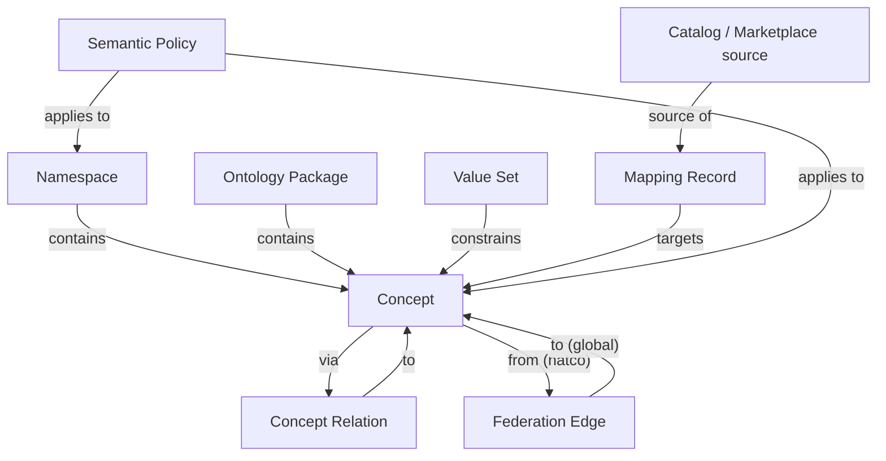

# Hierarchy And Relations — Semantic Control Plane

Peer matrix: [03. Catalog Tool Coverage](03.%20Catalog%20Tool%20Coverage.md)

## Object model

## Chains

| Chain | Path |
| --- | --- |
| Registry | Namespace → Concept |
| Package | Ontology Package → Concept |
| Values | Value Set → constrains Concept |
| Structure | Concept → Concept Relation → Concept |
| Mapping | External asset → Mapping Record → Concept |
| Federation | Concept (`natco-*` / `import-*`) → Federation Edge → Concept (`global`) |
| Governance | Semantic Policy → Namespace / Concept |

## Normative relations

| From | Predicate | To | Notes |
| --- | --- | --- | --- |
| Namespace | contains | Concept | Every concept in exactly one namespace |
| Ontology Package | contains | Concept | Versioned publish set |
| Value Set | constrains | Concept | Controlled values |
| Concept | related via | Concept | Concept Relation (≠ Federation) |
| Mapping Record | targets | Concept | Active mappings require `status=approved` on target |
| Concept | federates via Edge | Concept | Directed NATCO/import → global |
| Semantic Policy | applies to | Concept / Namespace | POL-SEM (≠ Business Catalog Policy) |

## Rules

1. Git Control Plane is the **only** SoR for enterprise meaning.  
2. Business Catalog Collibra semantic layer ≠ this pack.  
3. Prefer `global/*` mapping targets when meaning is shared.  
4. Cross-NATCO use of a NATCO concept requires an approved Federation Edge.  
5. Concept Relation is internal structure; Federation Edge is cross-namespace equivalence only.

JSON: [`hierarchy.relations.json`](hierarchy.relations.json)
