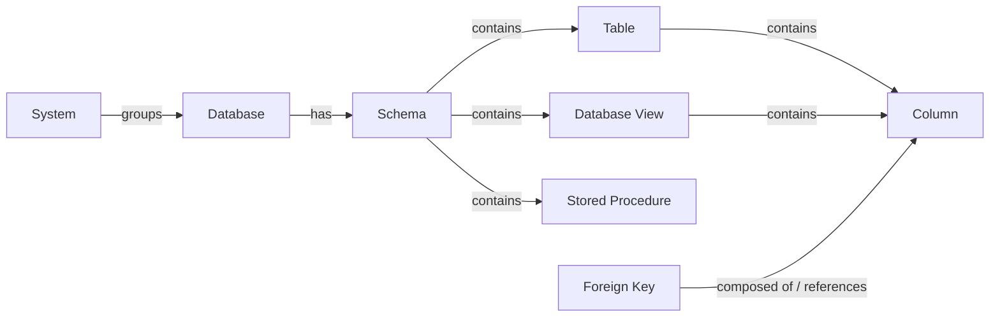
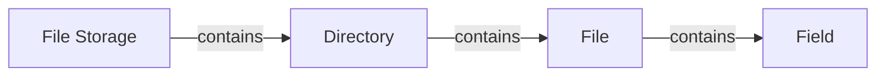
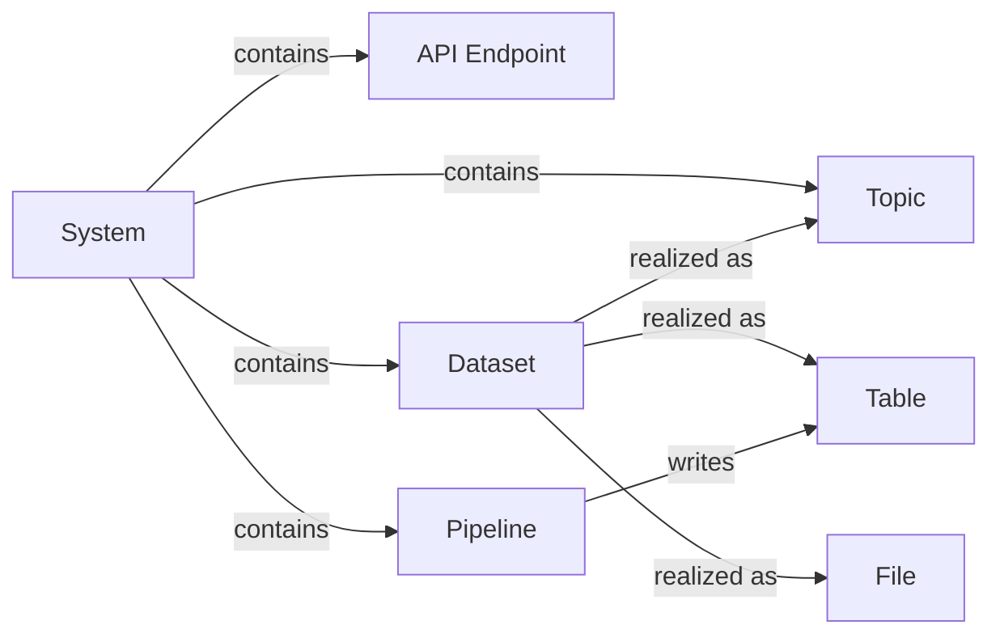

# Hierarchy And Relations

## Purpose

Freeze the **enterprise-standard containment hierarchies** for technical catalog assets (physical data layer + technology / file / streaming / pipeline assets).

Cross-tool matrix: [03. Catalog Tool Coverage](03.%20Catalog%20Tool%20Coverage.md)

Sources: Collibra OOTB · Dataplex Entries · OpenMetadata Table/Topic/Pipeline/API/StoredProcedure · physical data layer.

## Relational chain

| # | From | Predicate | To | Public ID | Cardinality |
| --- | --- | --- | --- | --- | --- |
| 1 | System | groups | Database | `TechnologyAssetGroupsTechnologyAsset` | `0..*` |
| 2 | Database | has | Schema | `TechnologyAssetHasSchema` | `0..*` |
| 3 | Schema | contains | Table | `SchemaContainsTable` | `0..*` |
| 4 | Schema | contains | Database View | `SchemaContainsTable` | `0..*` |
| 5 | Schema | contains | Stored Procedure | `SchemaContainsStoredProcedure` | `0..*` |
| 6 | Table / Database View | contains | Column | `TableContainsColumn` | `1..*` |
| 7 | Foreign Key | composed of / references | Column | `ForeignKeyComposedOfColumn` / `ForeignKeyReferencesColumn` | `1..*` |

## File / object storage chain

## Streaming / API / process / dataset

| From | Predicate | To |
| --- | --- | --- |
| System | contains | Topic / API Endpoint / Dataset / Pipeline |
| Dataset | realized as | Table / File / Topic |
| Pipeline | reads / writes | Table / File / Topic |
| Table / Column | represents | Registry Concept (DA-09) |
| # | From | Predicate | To | Public ID | Cardinality |
| --- | --- | --- | --- | --- | --- |
| 1 | File Storage | contains | Directory | `FileStorageContainsDirectory` | `0..*` |
| 2 | Directory | contains | File | `DirectoryContainsFile` | `0..*` |
| 3 | File | contains | Field | `FileContainsField` | `0..*` |

## Rules

| # | Rule |
| --- | --- |
| 1 | Every **Schema** belongs to exactly one **Database**. |
| 2 | Every **Table** / **Database View** belongs to exactly one **Schema**. |
| 3 | Every **Column** belongs to exactly one **Table** or **Database View**. |
| 4 | When `useCollibraSystemName=true`, group **Database** under **System** for stitching. |
| 5 | Do **not** use Database → contains → Table as primary (legacy only). |
| 6 | **Field** is the file analogue of **Column**. |
| 7 | Control Plane `represents` typically targets Table / View / File and Column / Field. |

## JSON contract

[`hierarchy.relations.json`](hierarchy.relations.json) — `ctr-tech-hierarchy-v1`

## Asset contracts

See [00. README.md](00.%20README.md) for the full inventory (12 asset types).

## Related

- [Collibra Documentation Standard](02.%20Collibra%20Documentation%20Standard.md)
- [Contracts hub](../00.%20README.md)
- [Technical Mapping](../../05.%20Enterprise%20Mapping/02.%20Technical%20Mapping.md)
